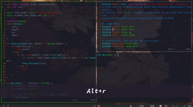

 # i3_intuitive_resize
 
 Resize the focused i3 window based on its position inside the workspace.

## When Intuition fails
- If window is neither on the left corner or the right corner
   - left -> means decrease width
   - right -> means increase width
- If window is neither on the top corner or the bottom corner
   - up -> means increase height
   - down -> means decrease height 
